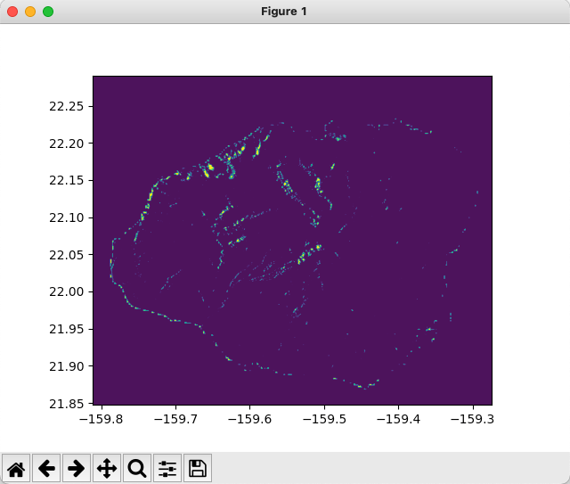

# eo-rbm-proc

EO River Basin Monitoring (Flood Mapping) using EO SNAP Toolbox.

Steps performed by the processor.

 * terrain correction
 * de-speckling
 * image calibration
 * orbit file application
 * subsetting of data using vector file input
 * image reclassification using band math calculations
 * land cover downloading
 * exporting of product objects to result file

## Usage

To produce

```
./eo-rbm.py \
   --product-path data/S1A_IW_GRDH_1SDV_20180415T163146_20180415T163211_021480_025003_8E79.zip \
   --shape-path data/boundary.shp \
   --result-path ./final_mask
```

To obtain help for the parameters, run

```
$ ./eo-rbm.py -h
usage: eo-rbm.py [-h] --product-path PRODUCT --shape-path SHAPE --result-path RESULT

EO Flood Monitoring

optional arguments:
  -h, --help            show this help message and exit

required named arguments:
  --product-path PRODUCT
                        Sentinel 1 data product archive
  --shape-path SHAPE    Shape file in .shp format
  --result-path RESULT  Path to resulting TIF file (w/o .tif)
$
```

## Example run

```
$ ./eo-rbm.py --product-path test-data/S1A_IW_GRDH_1SDV_20180415T163146_20180415T163211_021480_025003_8E79.zip --shape-path test-data/island_boundary2.shp --result-path ./final_mask-S1A
INFO: org.esa.s2tbx.dataio.gdal.GDALVersion: GDAL not found on system. Internal GDAL 3.0.0 from distribution will be used. (f1)
INFO: org.esa.s2tbx.dataio.gdal.GDALVersion: Internal GDAL 3.0.0 set to be used by SNAP.
INFO: org.esa.snap.core.gpf.operators.tooladapter.ToolAdapterIO: Initializing external tool adapters
INFO: org.esa.snap.core.util.EngineVersionCheckActivator: Please check regularly for new updates for the best SNAP experience.
INFO: org.esa.s2tbx.dataio.gdal.GDALVersion: Internal GDAL 3.0.0 set to be used by SNAP.
Width: 25220 px
Height: 16774 px
Name: S1A_IW_GRDH_1SDV_20180415T163146_20180415T163211_021480_025003_8E79
Band names: Amplitude_VH, Intensity_VH, Amplitude_VV, Intensity_VV
INFO: org.hsqldb.persist.Logger: dataFileCache open start

100% done.

100% done.
Width: 4871 px
Height: 4035 px
Name: Subset_S1A_IW_GRDH_1SDV_20180415T163146_20180415T163211_021480_025003_8E79_Orb
Band names: Amplitude_VH, Intensity_VH, Amplitude_VV, Intensity_VV

100% done.

100% done.

100% done.

100% done.

50%100% done.

100% done.

100% done.
writing product ...
done
```

Most of the time (~95%) is taken by writing of the product.

## Visualisation

Use `eo-rbm-vis.py` to visualise results.

On an example of the product produced in the previous section.

```
./eo-rbm-vis.py final_mask-S1A.tif
```

Produces the following result



## Building Docker image

```
docker image build . -t sixsq/eo-rbm:latest 
docker image push sixsq/eo-rbm:latest
```

## Running Docker image

Mount directory with the product and shape files to the container. Save
the result to the mounted volume.

```
 docker run --rm -it -v $(pwd)/test-data:/data sixsq/eo-rbm:latest \
    --product-path /data/S1A_IW_GRDH_1SDV_20180415T163146_20180415T163211_021480_025003_8E79.zip \
    --shape-path /data/island_boundary2.shp \
    --result-path /data/final_mask_S1A_IW_GRDH_1SDV_20180415T163146_20180415T163211_021480_025003_8E79
```
